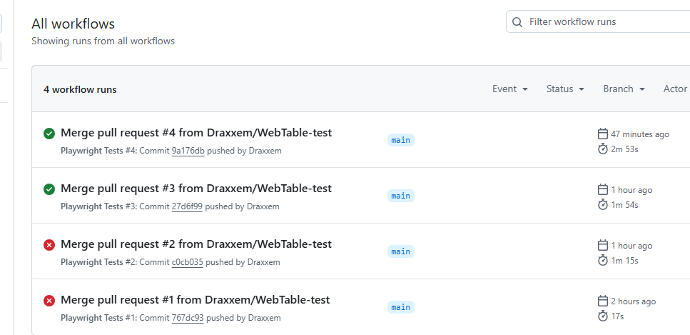
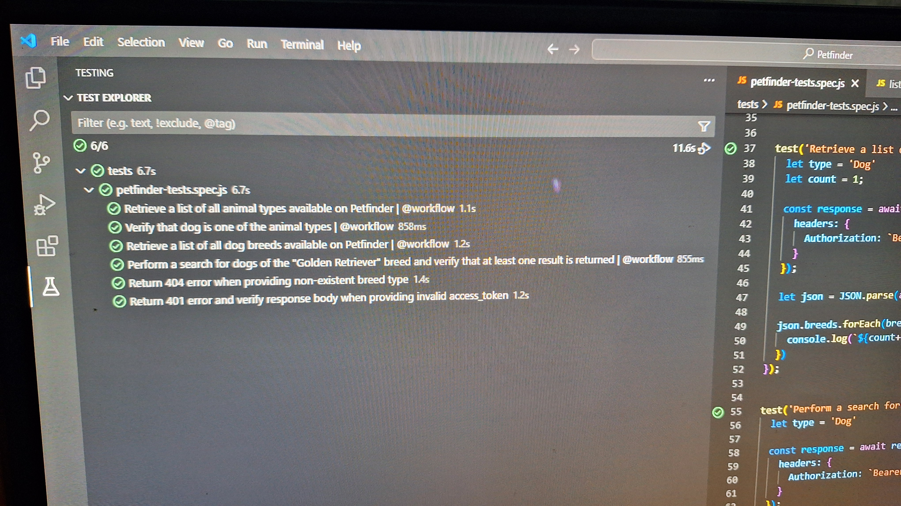

# Petfinder
Automated tests for the Petfinder API

#Setup instructions

Download latest version of Visual Studio Code
1. Create a folder on your C: drive named "CodeRepo", then Clone this repo - https://github.com/Draxxem/WebTable.git to that location
2. Once cloned open the project in VS Code
3. In the terminal run the following command to get all required dependencies 'npm ci'

How to run the tests
- From terminal
1. To execute all tests run the following command 'npx playwright test'
2. To execute all tests tagged as '@workflow' only, run the following command 'npx playwright test --grep "@workflow"'
3. To view test Report run 'npx monocart show-report test-results/report.html'

#OR

- From Test Explorer
1. Install Playwright Test for VSCode extension
2. Test will be visible from Test Explorer

#Guthub Workflow
A test job is triggered whenever a branch gets merged into main branch
1. You can also view test results of workflow runs on Github Action tab
2. A Test report is available to download by selecting a Workflow run ---> (https://github.com/Draxxem/WebTable/actions)

#Overview of project structure
- The root directory contains key configuration files such as package.json for dependencies and .env, .gitignore 
- The tests folder contains the file with the tests
- functions folder contains function that handles the secret manager and access token for PetFinder API
- test results gets saved to the test-results folder
- .github/Workflows folder contains the .yml with instructons for Github Workflow

#Any assumptions or decisions made
- I made the decision to make use of HashiCorp vault to manage the secrets used for the PetFinder API oauth2 call as it had a free option
- I decided to use playwright, as it is very easy to use with node.js, very easy to install any required packages, lot's of support for it and out of the box configuration file and easy to setup test reporting

#List of tools and resources used
- VSCode
- Node.js
- HashiCorp Vault
- Playwright

#Evidence
